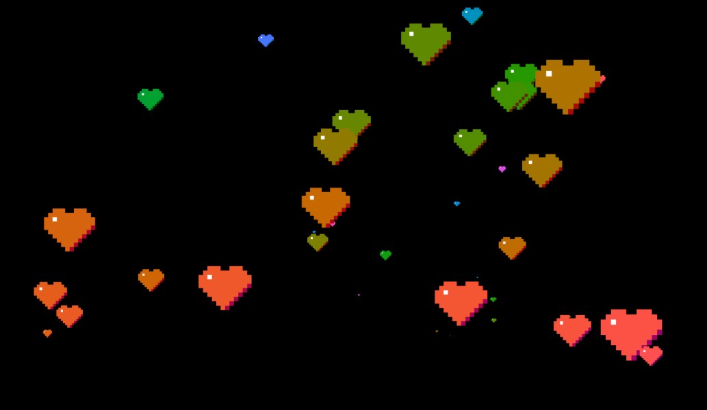
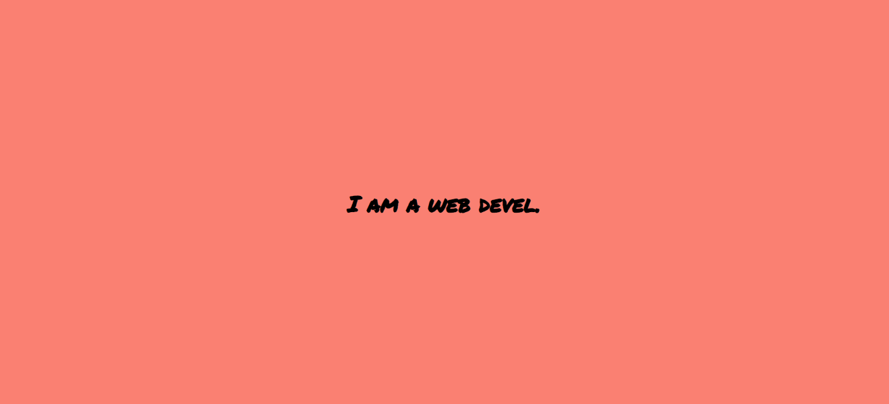
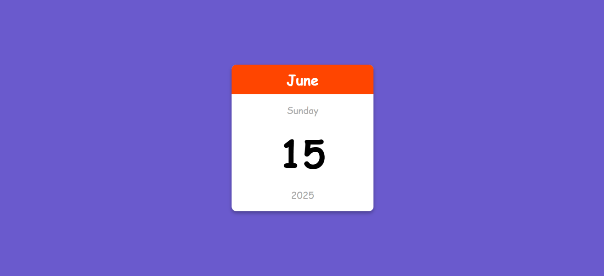

# 🚀 JavaScript Beginner Projects
---
### 1. ❤ Heart Trail Animation
generates heart images as you move you cursor around.

### 2. 🔠 Auto Text Effect Animation
gives a writing effect to your text.

### 3. 📅 Mini Calendar
a simple calender, tell current month, day, date, and year.

### 4. ✨ Button-Ripple-Effect
this gives your button a ripple effect when hovered from any side.

